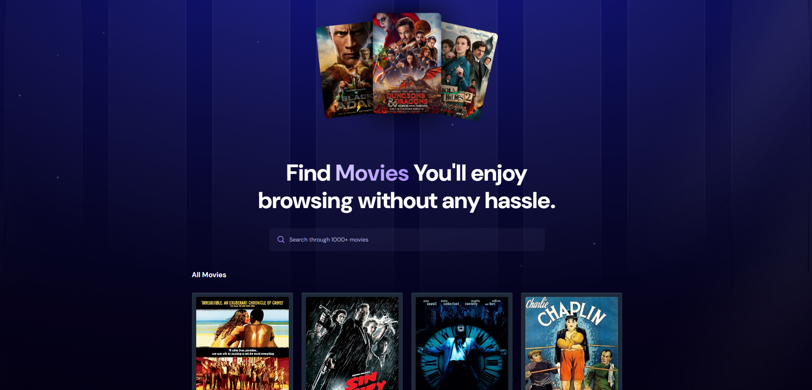

📽️ MoviesLand 🎬
A sleek movie search app built with React + Vite using the OMDB API. Browse random trending movies, search for your favorites, and enjoy a clean, modern UI—all powered by TailwindCSS.

🚀 Features
🔍 Search through 1000+ movies using the OMDB API
🎞️ Random movies on first load (random keywords)
🌟 Shows rating, release year, and language
📉 Handles missing posters gracefully
🖼️ Beautiful Hero Section with background image
📱 Fully responsive layout
🔧 Easily customizable and deployable

🛠️ Tech Stack
React + Vite
TailwindCSS
OMDB API
Git + GitHub

🔧 Installation & Setup
Clone the repository: git clone https://github.com/your-username/movieapp.git
cd movieapp
Install dependencies:  npm install

Set your OMDB API key
Create a .env.local file in the root
VITE_OMDB_API_KEY= your_api_key_here

Run the app: npm run dev

🌐 Deployment (GitHub Pages / Vercel)
GitHub Pages: Use vite.config.js to set the base path and deploy using gh-pages
Vercel: Simply import your GitHub repo to https://vercel.com, and it handles everything

📁 Folder Structure
movieapp/
│
├── public/
│   ├── no-movie.png        ← fallback image
│   ├── cover.png           ← banner for README
│   └── Screenshot 2025-06-25 214725.png ← screenshot
│
├── src/
│   ├── components/         ← UI components
│   ├── App.jsx             ← main logic
│   └── ...
│
├── .env.local              ← API key
├── vite.config.js
└── README.md

✨ Future Features
🔥 Trending section using TMDB API
🧠 Auto-suggestions while searching
🎭 Genre filters
❤️ Add to favorites (localStorage)
🌍 Multi-language support

🤝 Contributing
Fork the repo
Create your feature branch (git checkout -b feature-name)
Commit your changes (git commit -m 'add feature')
Push to the branch (git push origin feature-name)
Open a Pull Request

